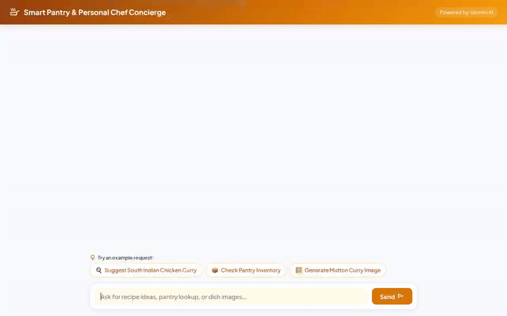

# Smart Pantry & Personal Chef Concierge

A conversational AI agent built with Google Agent Development Kit (ADK) and Vertex AI that helps home cooks plan meals, Persist pantry inventory in Firestore, calculate recipe macros in a secure code sandbox, generate custom dish images/videos, and deliver interactive UI cards.



---

## 🌟 Implemented Features & Google Cloud Services

The agent codebase (`app/agent.py`) actively implements the following capabilities:

- **🧠 Memory Bank (Agent Engine Memory Service)**: Remembers user dietary preferences, spice tolerance, and favorite cuisines (e.g., South Indian dishes) across conversation turns.
- **🗄️ Pantry Storage (Google Cloud Firestore)**: Persistent database tracking of household pantry ingredients with tools to query and update stock (`get_pantry_inventory`, `add_or_update_pantry_item`).
- **🍳 Recipe Catalog Integration**: Connects to TheMealDB API to search for recipes, retrieve step-by-step cooking instructions, and inspect required ingredients (`search_recipes`, `get_recipe_details`, `fetch_online_recipes`).
- **🛒 Shopping List Generator**: Automatically compares missing recipe ingredients with pantry inventory to generate custom shopping lists (`generate_shopping_list_for_recipe`).
- **💻 Precision Macro Sandbox (AgentEngineSandboxCodeExecutor)**: Safely executes Python code inside a sandboxed environment to calculate nutritional macronutrients (calories, protein, carbs, fats) scaled to requested serving sizes (`calculate_recipe_macros`).
- **🖼️ AI Dish Image Generation (Vertex AI `gemini-3.1-flash-lite-image`)**: Generates appetizing food photos on demand, saving ADK artifacts and uploading public media bytes to Google Cloud Storage (`smart-pantry-chef-media-13bb0a69`).
- **🎥 AI Dish Video Generation (Google Omni `gemini-omni-flash-preview`)**: Generates short video clips for food items using Google's Omni model in the global region, saving ADK artifacts and uploading to Cloud Storage (`generate_ai_dish_video`).
- **🎨 Interactive UI Surfaces (A2UI)**: Renders rich, interactive UI cards using `A2uiSchemaManager` (v0.8) and the Basic Catalog via an `after_model_callback`.
- **💻 Web Chat Frontend**: A lightweight FastAPI proxy and customized culinary chat UI (`frontend/`) with branded header and prompt action pills.

---

## 📌 Planned Features (Not Yet Implemented)

The following capabilities were outlined in early planning specs (`project_brief.md`) but are **planned, not yet implemented**:

- 📅 *Automated Weekly Meal Plan Calendar Generator*
- 📊 *Household Calorie & Budget Tracker*

---

## 🛠️ Project Structure

```
.
├── app/
│   ├── __init__.py
│   ├── agent.py               # Core ADK agent definition & tools
│   ├── a2ui_utils.py          # A2UI schema manager & callback logic
│   ├── GEMINI.md              # Agent system instructions & guidance
│   └── deployment_metadata.json
├── frontend/
│   ├── main.py                # FastAPI proxy server for deployed Agent Engine
│   └── static/
│       └── index.html         # Custom web chat interface
├── agents-cli-manifest.yaml    # Project configuration manifest
├── demo.gif                   # Looping demo recording
└── README.md
```

---

## 🚀 Local Setup & Run Instructions

### Prerequisites
- Python 3.10+
- `uv` or `pip`
- Google Cloud Project with Vertex AI and Firestore enabled

### 1. Environment Setup

Clone the repository and install dependencies:

```bash
uv venv
source .venv/bin/activate
uv pip install -r requirements.txt
```

### 2. Set Up Environment Variables

Set your Google Cloud Project ID and MealDB API Key:

```bash
export GOOGLE_CLOUD_PROJECT="<your-gcp-project-id>"
export MEALDB_API_KEY="1"
```

### 3. Run the Playground Locally

Start the local ADK playground with Memory Service enabled:

```bash
uv run adk web . --port 8080 --reload_agents --memory_service_uri=agentengine://5380160533603287040
```

### 4. Run the Custom Web Frontend

To launch the web proxy frontend:

```bash
export AGENT_ENGINE_RESOURCE_NAME="projects/<PROJECT_NUMBER>/locations/<REGION>/reasoningEngines/<ENGINE_ID>"
export AGENT_DIRECTORY="app"
export PORT="8080"

cd frontend
uv run python main.py
```

---

## 🌐 End-to-End Production Deployment & Distribution Guide

Follow these step-by-step instructions to deploy this agent into production on Google Cloud and share it live with end users:

### Step 1: GCP Project Infrastructure Setup

1. **Set your GCP project**:
   ```bash
   gcloud config set project YOUR_PROJECT_ID
   ```
2. **Enable required Google Cloud APIs**:
   ```bash
   gcloud services enable \
     aiplatform.googleapis.com \
     datastore.googleapis.com \
     storage.googleapis.com \
     run.googleapis.com \
     cloudbuild.googleapis.com \
     artifactregistry.googleapis.com
   ```
3. **Provision Database & Storage Bucket**:
   - Create a Firestore Database in Native Mode via Google Cloud Console or CLI.
   - Create a public Google Cloud Storage bucket for generated dish images and videos:
     ```bash
     gsutil mb -l us-central1 gs://smart-pantry-chef-media-YOUR_PROJECT_ID
     gsutil iam ch allUsers:objectViewer gs://smart-pantry-chef-media-YOUR_PROJECT_ID
     ```

---

### Step 2: Deploy Agent to Agent Runtime (Vertex AI Reasoning Engine)

1. **Deploy using `agents-cli`**:
   ```bash
   agents-cli deploy --manifest agents-cli-manifest.yaml
   ```
2. **Note the Deployment Metadata**:
   The command creates `deployment_metadata.json` containing your `remote_agent_runtime_id`:
   ```json
   {
     "remote_agent_runtime_id": "projects/PROJECT_NUMBER/locations/us-central1/reasoningEngines/ENGINE_ID"
   }
   ```

---

### Step 3: Grant IAM Permissions to Agent Service Account

Grant the deployed Reasoning Engine Service Account access to Firestore, Cloud Storage, and Vertex AI models:

```bash
# Get your project service account or runtime service account
PROJECT_NUMBER=$(gcloud projects describe YOUR_PROJECT_ID --format="value(projectNumber)")
SA_EMAIL="${PROJECT_NUMBER}-compute@developer.gserviceaccount.com"

# Grant Firestore User role
gcloud projects add-iam-policy-binding YOUR_PROJECT_ID \
  --member="serviceAccount:${SA_EMAIL}" \
  --role="roles/datastore.user"

# Grant Storage Admin role on media bucket
gcloud storage buckets add-iam-policy-binding gs://smart-pantry-chef-media-YOUR_PROJECT_ID \
  --member="serviceAccount:${SA_EMAIL}" \
  --role="roles/storage.objectAdmin"

# Grant Vertex AI User role
gcloud projects add-iam-policy-binding YOUR_PROJECT_ID \
  --member="serviceAccount:${SA_EMAIL}" \
  --role="roles/aiplatform.user"
```

---

### Step 4: Deploy Web Chat Frontend to Cloud Run

Deploy the FastAPI proxy frontend (`frontend/`) to Cloud Run so end users can access the web application securely:

1. **Deploy to Cloud Run**:
   ```bash
   gcloud run deploy smart-pantry-chef-frontend \
     --source ./frontend \
     --region us-central1 \
     --set-env-vars AGENT_ENGINE_RESOURCE_NAME="projects/PROJECT_NUMBER/locations/us-central1/reasoningEngines/ENGINE_ID",AGENT_DIRECTORY="app" \
     --allow-unauthenticated
   ```
2. **Retrieve Production Public URL**:
   Cloud Run will output a public HTTPS URL upon deployment success (e.g., `https://smart-pantry-chef-frontend-xyz-uc.a.run.app`).

---

### Step 5: Share Live Application with End Users

1. **Distribute Web URL**: Provide the Cloud Run HTTPS URL to your users.
2. **User Experience**: Users open the link in any modern web browser to:
   - Ask for custom recipes tailored to their preferences stored in Memory Bank.
   - Interact with live A2UI rich recipe cards.
   - View persistent pantry stock stored in Firestore.
   - View automatically generated AI dish photos and video clips hosted on Cloud Storage.

